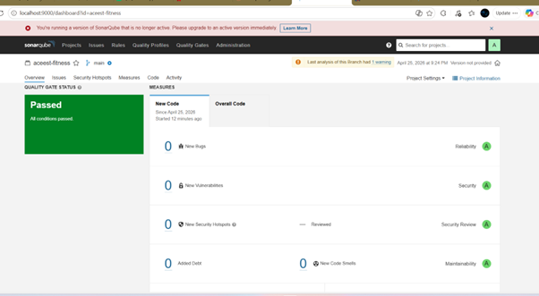

# ACEest Fitness & Gym — DevOps CI/CD Project

> **Course:** Introduction to DevOps (CSIZG514 / SEZG514 / SEUSZG514) — S2-25  
> **Assignment:** 1 & 2 — Automated CI/CD Pipelines & Cloud Deployment

---

## Table of Contents

1. [Project Overview](#project-overview)
2. [Tech Stack](#tech-stack)
3. [Repository Structure](#repository-structure)
4. [Local Setup & Execution](#local-setup--execution)
5. [Running Tests Manually](#running-tests-manually)
6. [Docker Usage](#docker-usage)
7. [Jenkins BUILD Integration](#jenkins-build-integration)
8. [GitHub Actions CI/CD Pipeline](#github-actions-cicd-pipeline)
9. [Kubernetes Deployment](#kubernetes-deployment)
10. [Cloud Deployment (AKS)](#cloud-deployment-aks)
11. [API Reference](#api-reference)
12. [Version History](#version-history)

---

## Project Overview

ACEest Fitness & Gym is a Flask-based REST API that manages gym client profiles, fitness programs, calorie estimation, and BMI calculation. The project demonstrates a complete, production-grade DevOps pipeline spanning local development, automated build, cloud deployment, and Kubernetes orchestration:

- **Version Control** with Git & GitHub
- **Containerisation** with Docker (multi-stage build, non-root user, Docker Hub registry)
- **Build Automation** via Jenkins (8-stage declarative pipeline with webhook triggers)
- **Static Code Analysis** via SonarQube with quality gate enforcement
- **CI/CD Pipeline** via GitHub Actions (lint → docker-build → test)
- **Automated Testing** with Pytest (33 test cases inside containerised environment)
- **Container Registry** via Docker Hub (`akshaya45/aceest-app`)
- **Local Kubernetes Deployment** via Minikube with all 5 deployment strategies
- **Cloud Deployment** via Azure Kubernetes Service (AKS) with public endpoint `http://135.234.232.5`
- **Deployment Strategies** — Rolling Update, Blue-Green, Canary, A/B Testing, Shadow

---

## Tech Stack

| Component          | Technology                         |
|--------------------|------------------------------------|
| Language           | Python 3.14                        |
| Web Framework      | Flask 3.0                          |
| Testing            | Pytest + pytest-cov                |
| Lint               | flake8                             |
| Code Quality       | SonarQube (LTS Community)          |
| Container          | Docker (multi-stage)               |
| Container Registry | Docker Hub (akshaya45/aceest-app)  |
| CI/CD              | GitHub Actions                     |
| Build server       | Jenkins                            |
| Local Kubernetes   | Minikube                           |
| Cloud Kubernetes   | Azure Kubernetes Service (AKS)     |

---

## Repository Structure

```
aceest-fitness/
├── app.py                         # Flask application (core logic + routes)
├── requirements.txt               # Python dependencies
├── Dockerfile                     # Multi-stage Docker build
├── Jenkinsfile                    # Jenkins declarative pipeline
├── README.md
├── screenshots/                   # Pipeline & execution screenshots
├── k8s/                           # Kubernetes manifests
│   ├── deployment.yaml            # Base deployment
│   ├── service.yaml               # Base service
│   ├── rolling-update.yaml        # Rolling update strategy
│   ├── blue-green.yaml            # Blue-green strategy
│   ├── canary.yaml                # Canary release strategy
│   ├── ab-testing.yaml            # A/B testing strategy
│   ├── shadow.yaml                # Shadow deployment strategy
│   └── aks-deployment.yaml        # AKS cloud deployment
├── tests/
│   └── test_app.py                # Pytest test suite (33 test cases)
└── .github/
    └── workflows/
        └── main.yml               # GitHub Actions pipeline
```

---

## Local Setup & Execution

### Prerequisites

- Python 3.12+
- pip
- Docker (optional, for container testing)

### Steps

```bash
# 1. Clone the repository
git clone https://github.com/2024tm93696-design/aceest-fitness-devops-Assignment1.git
cd aceest-fitness-devops-Assignment1

# 2. Create and activate a virtual environment
python -m venv venv
source venv/bin/activate          # Windows: venv\Scripts\activate

# 3. Install dependencies
pip install -r requirements.txt

# 4. Run the Flask development server
python app.py
# → Application available at http://127.0.0.1:5000

# 5. Verify it is running
curl http://127.0.0.1:5000/health
# Expected: {"status": "healthy"}
```

### Flask App Running Locally


---

## Running Tests Manually

### Using Pytest directly

```bash
# From the project root (virtual env active):
pytest tests/ -v

# With coverage report:
pytest tests/ -v --cov=app --cov-report=term-missing
```

### Expected output

```
tests/test_app.py::TestBusinessLogic::test_calculate_calories_fat_loss  PASSED
tests/test_app.py::TestBusinessLogic::test_calculate_bmi_normal          PASSED
...
============================= 33 passed in 0.xx s ==============================
```

### Test Suite Passing


---

## Docker Usage

### Build the image

```bash
docker build -t aceest-app .
```


### Run the container

```bash
docker run -p 5000:5000 aceest-app
# → API available at http://localhost:5000
```


### Application Running in Docker


### Docker Image


### Run tests inside the container

```bash
docker run --rm -v ${PWD}/tests:/app/tests aceest-app python -m pytest tests/ -v
```


### Docker Hub

The image is published to Docker Hub and pulled automatically by Kubernetes during deployments:

```bash
docker pull akshaya45/aceest-app:latest
```

---

## Jenkins BUILD Integration

### Overview

Jenkins is configured as the **BUILD quality gate**. It pulls the latest code from GitHub, runs lint checks, performs SonarQube static analysis, executes the Pytest suite, builds the Docker image, and pushes it to Docker Hub — all inside a declarative pipeline defined in `Jenkinsfile`.

### Pipeline Stages

| Stage                  | Description                                                    |
|------------------------|----------------------------------------------------------------|
| **Checkout**           | Pulls latest code from the configured GitHub repository        |
| **Environment Setup**  | Creates a Python venv and installs all dependencies            |
| **Lint**               | Runs `flake8` to catch syntax errors and undefined names       |
| **SonarQube Analysis** | Runs static code analysis and submits report to SonarQube      |
| **Quality Gate**       | Waits for SonarQube quality gate — aborts pipeline on failure  |
| **Unit Tests**         | Executes `pytest` and publishes JUnit XML results              |
| **Docker Build**       | Builds and tags the Docker image with build number             |
| **Docker Push**        | Pushes versioned image to `akshaya45/aceest-app` on Docker Hub |
| **Docker Test**        | Runs the full Pytest suite *inside* the Docker container       |

### Setup Steps in Jenkins

1. **Install plugins:** Git, Pipeline, Docker Pipeline, JUnit, SonarQube Scanner.
2. **Create a new Pipeline job** → *Pipeline script from SCM*.
3. Set SCM to **Git**, enter the GitHub repository URL.
4. Set the **Script Path** to `Jenkinsfile`.
5. Configure a **GitHub webhook** (`/github-webhook/`) to trigger builds on push.
6. Configure SonarQube server in **Manage Jenkins → System → SonarQube servers**.
7. Save and click **Build Now** to run the first build.

### Jenkins Build Success


### Post-build

- **SUCCESS** — image `akshaya45/aceest-app:<build_number>` is pushed to Docker Hub.
- **FAILURE** — console output shows the failing stage and error details.

---

## GitHub Actions CI/CD Pipeline

### Overview

The pipeline defined in `.github/workflows/main.yml` runs automatically on every `push` and `pull_request` to any branch. It consists of three sequential jobs:

```
lint-and-build → docker-build → test
```

### Job Breakdown

#### 1. `lint-and-build` — Lint & Syntax Check

- Sets up Python 3.12.
- Installs dependencies and `flake8`.
- Runs `flake8` to detect syntax errors (`E9`, `F63`, `F7`, `F82`).
- Fails the pipeline immediately on any syntax error.

#### 2. `docker-build` — Docker Image Assembly

- Uses Docker Buildx with GitHub Actions layer caching.
- Builds the image using the multi-stage `Dockerfile`.

#### 3. `test` — Automated Testing (Pytest in Docker)

- Rebuilds the Docker image.
- Mounts the `tests/` directory into the container.
- Executes the full Pytest suite inside the containerised environment.
- Uploads test results as a pipeline artifact.

### GitHub Actions Workflow


### CI/CD Pipeline Passing


### Trigger

```yaml
on:
  push:
    branches: ["**"]
  pull_request:
    branches: ["**"]
```

Every push to any branch triggers the full pipeline, providing rapid feedback on code quality and test stability.

---

## SonarQube Code Quality

### Overview

SonarQube is integrated into the Jenkins pipeline as a mandatory **static code analysis and quality gate** step. The analysis runs automatically on every build and must pass before the pipeline proceeds to containerisation and deployment.

- **SonarQube URL:** `http://localhost:9000`
- **Project Key:** `aceest-fitness`
- **Dashboard:** `http://localhost:9000/dashboard?id=aceest-fitness`

### How It Works

1. Jenkins runs `sonar-scanner` against the codebase after the Lint stage.
2. SonarQube analyses the code for bugs, vulnerabilities, code smells, and coverage.
3. A **Quality Gate** check runs — if it fails, the entire pipeline is aborted automatically.
4. Results are available on the SonarQube dashboard in real time.

### Pipeline Integration

```groovy
stage('SonarQube Analysis') {
    steps {
        withSonarQubeEnv('SonarQube') {
            bat """
                sonar-scanner ^
                -Dsonar.projectKey=aceest-fitness ^
                -Dsonar.sources=. ^
                -Dsonar.host.url=http://localhost:9000
            """
        }
    }
}

stage('Quality Gate') {
    steps {
        timeout(time: 5, unit: 'MINUTES') {
            waitForQualityGate abortPipeline: true
        }
    }
}
```

### Quality Results

| Metric | Result |
|---|---|
| Bugs | 0 |
| Vulnerabilities | 0 |
| Code Smells | 0 Critical |
| Quality Gate | Passed |
| Lint (flake8) | Passed |

### SonarQube Dashboard



---

## Kubernetes Deployment

### Overview

The application is deployed to Kubernetes using five deployment strategies, validated locally on Minikube before production deployment on AKS.

### Prerequisites

```bash
# Install Minikube
winget install Kubernetes.minikube

# Start Minikube
minikube start --driver=docker
```

### Deployment Strategies

| Strategy       | File                      | NodePort    | Description                                       |
|----------------|---------------------------|-------------|---------------------------------------------------|
| Rolling Update | `k8s/rolling-update.yaml` | 30002       | Gradual pod replacement with zero downtime        |
| Blue-Green     | `k8s/blue-green.yaml`     | 30003       | Instant traffic switch between two environments   |
| Canary         | `k8s/canary.yaml`         | 30004       | 10% traffic to new version, 90% to stable         |
| A/B Testing    | `k8s/ab-testing.yaml`     | 30005/30006 | Two independent versions for feature testing      |
| Shadow         | `k8s/shadow.yaml`         | 30007/30008 | Mirror traffic to shadow without affecting prod   |

### Deploy all strategies

```bash
kubectl apply -f k8s/rolling-update.yaml
kubectl apply -f k8s/blue-green.yaml
kubectl apply -f k8s/canary.yaml
kubectl apply -f k8s/ab-testing.yaml
kubectl apply -f k8s/shadow.yaml
```

### Get service URLs

```bash
minikube service aceest-rolling-service --url 
minikube service aceest-bluegreen-service --url
minikube service aceest-canary-service --url
minikube service aceest-ab-service-a --url
minikube service aceest-production-service --url
```

### Rollback

```bash
# Rollback to previous version
kubectl rollout undo deployment/aceest-fitness

# Check rollout history
kubectl rollout history deployment/aceest-fitness
```

---

## Cloud Deployment (AKS)

### Overview

The application is deployed to **Azure Kubernetes Service (AKS)** for production, providing a publicly accessible endpoint for evaluation.

- **Live Endpoint:** `http://135.234.232.5`
- **Health Check:** `http://135.234.232.5/health` → `{"status": "healthy"}`
- **Cluster:** `aceest-fitness-cluster` on Azure eastus region
- **Kubernetes Version:** 1.34.4

### Deploy to AKS

```bash
# Connect to AKS cluster
az aks get-credentials --resource-group aceest-fitness-rg --name aceest-fitness-cluster

# Deploy application
kubectl apply -f k8s/aks-deployment.yaml

# Get public IP
kubectl get service aceest-fitness-aks-service
```

### Manage AKS Cluster

```bash
# Stop cluster (saves cost)
az aks stop --name aceest-fitness-cluster --resource-group aceest-fitness-rg

# Start cluster
az aks start --name aceest-fitness-cluster --resource-group aceest-fitness-rg
```

---

## API Reference

| Method   | Endpoint            | Description                     |
|----------|---------------------|---------------------------------|
| `GET`    | `/`                 | Application status              |
| `GET`    | `/health`           | Health check                    |
| `GET`    | `/programs`         | List all fitness programs       |
| `GET`    | `/programs/<name>`  | Get program details             |
| `GET`    | `/clients`          | List all clients                |
| `POST`   | `/clients`          | Create / update a client        |
| `GET`    | `/clients/<name>`   | Get a single client profile     |
| `DELETE` | `/clients/<name>`   | Delete a client                 |
| `POST`   | `/calories`         | Estimate daily calories         |
| `POST`   | `/bmi`              | Calculate BMI and risk category |

### Example: Create a client

```bash
curl -X POST "http://135.234.232.5/clients" \
  -H "Content-Type: application/json" \
  -d '{"name":"Arjun","program":"Fat Loss (FL)","weight":75,"age":28,"adherence":80}'
```

### Example: Health Check

```bash
curl http://135.234.232.5/health
# Expected: {"status": "healthy"}
```

---

## Version History

The desktop application passed through 10 iterative versions before being re-architected as a Flask API for DevOps compatibility:

| Version       | Key Features Added                                            |
|---------------|---------------------------------------------------------------|
| 1.0           | Tkinter GUI, 3 programs (FL/MG/BG), workout & diet display   |
| 1.1 / 1.1.2   | Client profile inputs, calorie estimation, style improvements |
| 2.0.1         | SQLite persistence, Save/Load client, weekly progress logging |
| 2.1.2         | Matplotlib progress chart visualisation                       |
| 2.2.1         | Extended DB schema (height, targets, workouts, metrics)       |
| 2.2.4         | Duplicate of 2.2.1 with minor fixes                          |
| 3.0.1         | Login/role system, AI program generator, PDF export (fpdf)   |
| 3.1.2         | Refactored dashboard, membership billing, workout tab         |
| 3.2.4         | In-memory multi-client list, CSV export, embedded charts      |
| **Flask API** | **REST API — DevOps-ready, containerised, cloud-deployed**   |
