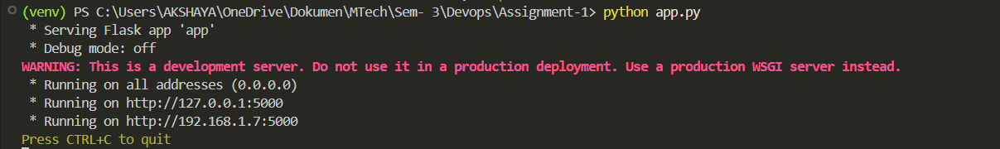
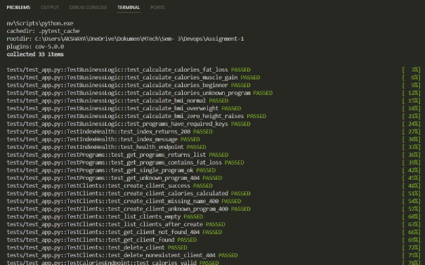
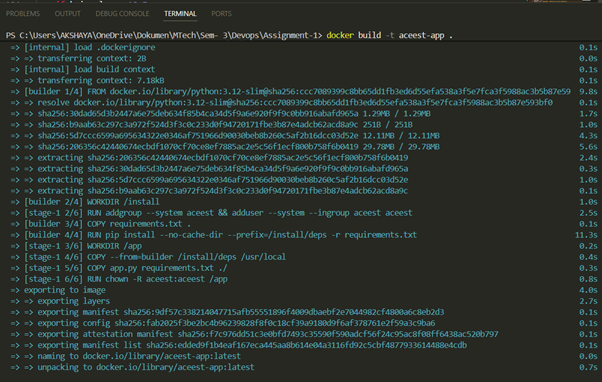
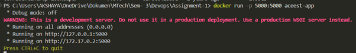
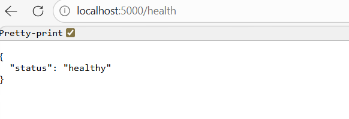
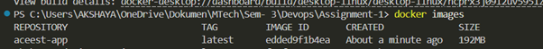
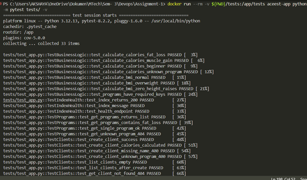
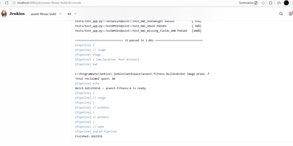
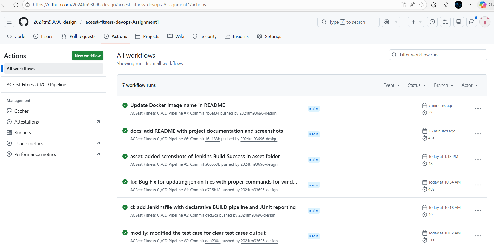
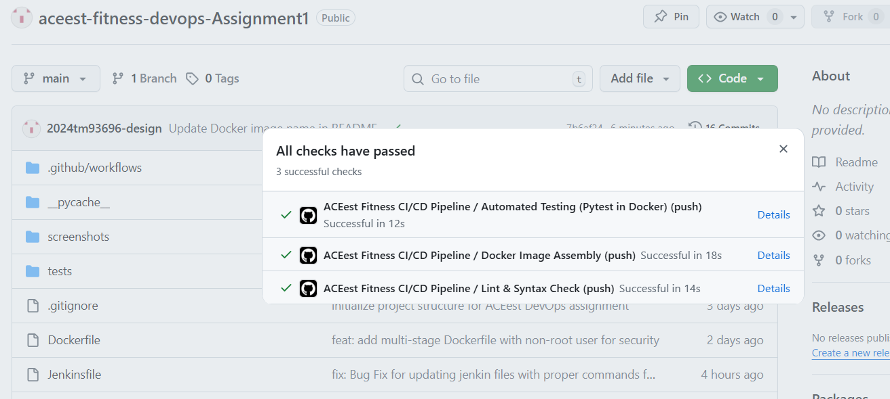

# ACEest Fitness & Gym — DevOps CI/CD Project

> **Course:** Introduction to DevOps (CSIZG514 / SEZG514 / SEUSZG514) — S2-25  
> **Assignment:** 1 — Automated CI/CD Pipelines

---

## Table of Contents

1. [Project Overview](#project-overview)
2. [Tech Stack](#tech-stack)
3. [Repository Structure](#repository-structure)
4. [Local Setup & Execution](#local-setup--execution)
5. [Running Tests Manually](#running-tests-manually)
6. [Docker Usage](#docker-usage)
7. [Jenkins BUILD Integration](#jenkins-build-integration)
8. [GitHub Actions CI/CD Pipeline](#github-actions-cicd-pipeline)
9. [API Reference](#api-reference)
10. [Version History](#version-history)

---

## Project Overview

ACEest Fitness & Gym is a Flask-based REST API that manages gym client profiles, fitness programs, calorie estimation, and BMI calculation. The project demonstrates a complete DevOps pipeline:

- **Version Control** with Git & GitHub  
- **Containerisation** with Docker (multi-stage build)  
- **BUILD automation** via Jenkins  
- **CI/CD pipeline** via GitHub Actions  
- **Automated testing** with Pytest  

---

## Tech Stack

| Component     | Technology            |
|---------------|-----------------------|
| Language      | Python 3.12           |
| Web Framework | Flask 3.0             |
| Testing       | Pytest + pytest-cov   |
| Container     | Docker (multi-stage)  |
| CI/CD         | GitHub Actions        |
| Build server  | Jenkins               |

---

## Repository Structure

```
aceest-fitness/
├── app.py                         # Flask application (core logic + routes)
├── requirements.txt               # Python dependencies
├── Dockerfile                     # Multi-stage Docker build
├── Jenkinsfile                    # Jenkins declarative pipeline
├── README.md
├── screenshots/                   # Pipeline & execution screenshots
├── tests/
│   └── test_app.py                # Pytest test suite (38 test cases)
└── .github/
    └── workflows/
        └── main.yml               # GitHub Actions pipeline
```

---

## Local Setup & Execution

### Prerequisites

- Python 3.12+
- pip
- Docker (optional, for container testing)

### Steps

```bash
# 1. Clone the repository
git clone https://github.com/<your-username>/aceest-fitness.git
cd aceest-fitness

# 2. Create and activate a virtual environment
python -m venv venv
source venv/bin/activate          # Windows: venv\Scripts\activate

# 3. Install dependencies
pip install -r requirements.txt

# 4. Run the Flask development server
python app.py
# → Application available at http://127.0.0.1:5000

# 5. Verify it is running
curl http://127.0.0.1:5000/health
# Expected: {"status": "healthy"}
```

### Flask App Running Locally



---

## Running Tests Manually

### Using Pytest directly

```bash
# From the project root (virtual env active):
pytest tests/ -v

# With coverage report:
pytest tests/ -v --cov=app --cov-report=term-missing
```

### Expected output

```
tests/test_app.py::TestBusinessLogic::test_calculate_calories_fat_loss  PASSED
tests/test_app.py::TestBusinessLogic::test_calculate_bmi_normal          PASSED
...
============================= 33 passed in 0.xx s ==============================
```

### Test Suite Passing



---

## Docker Usage

### Build the image

```bash
docker build -t aceest-fitness:latest .
```



### Run the container

```bash
docker run -p 5000:5000 aceest-fitness:latest
# → API available at http://localhost:5000
```



### Application Running in Docker



### Docker Image



### Run tests inside the container

```bash
docker run --rm \
  -v "$(pwd)/tests:/app/tests" \
  aceest-fitness:latest \
  python -m pytest tests/ -v
```



---

## Jenkins BUILD Integration

### Overview

Jenkins is configured as the **BUILD quality gate**. It pulls the latest code from GitHub, runs lint checks, executes the Pytest suite, and builds the Docker image — all inside a declarative pipeline defined in `Jenkinsfile`.

### Pipeline Stages

| Stage              | Description                                              |
|--------------------|----------------------------------------------------------|
| **Checkout**       | Pulls latest code from the configured GitHub repository  |
| **Environment Setup** | Creates a Python venv and installs all dependencies   |
| **Lint**           | Runs `flake8` to catch syntax errors and undefined names |
| **Unit Tests**     | Executes `pytest` and publishes JUnit XML results        |
| **Docker Build**   | Builds and tags the Docker image                         |
| **Docker Test**    | Runs the full Pytest suite *inside* the Docker container |

### Setup Steps in Jenkins

1. **Install plugins:** Git, Pipeline, Docker Pipeline, JUnit.
2. **Create a new Pipeline job** → *Pipeline script from SCM*.
3. Set SCM to **Git**, enter the GitHub repository URL.
4. Set the **Script Path** to `Jenkinsfile`.
5. Configure a **GitHub webhook** (`/github-webhook/`) to trigger builds on push.
6. Save and click **Build Now** to run the first build.

### Jenkins Build Success




### Post-build

- ✅ **SUCCESS** — image `aceest-fitness:<build_number>` is ready.
- ❌ **FAILURE** — console output shows the failing stage and error details.

---

## GitHub Actions CI/CD Pipeline

### Overview

The pipeline defined in `.github/workflows/main.yml` runs automatically on every `push` and `pull_request` to any branch. It consists of three sequential jobs:

```
lint-and-build → docker-build → test
```

### Job Breakdown

#### 1. `lint-and-build` — Lint & Syntax Check

- Sets up Python 3.12.
- Installs dependencies and `flake8`.
- Runs `flake8` to detect syntax errors (`E9`, `F63`, `F7`, `F82`).
- Fails the pipeline immediately on any syntax error.

#### 2. `docker-build` — Docker Image Assembly

- Uses Docker Buildx with GitHub Actions layer caching.
- Builds the image using the multi-stage `Dockerfile`.
- Does **not** push to a registry (add Docker Hub secrets to enable).

#### 3. `test` — Automated Testing (Pytest in Docker)

- Rebuilds the Docker image.
- Mounts the `tests/` directory into the container.
- Executes the full Pytest suite inside the containerised environment.
- Uploads test results as a pipeline artifact.

### GitHub Actions Workflow



### CI/CD Pipeline Passing



### Trigger

```yaml
on:
  push:
    branches: ["**"]
  pull_request:
    branches: ["**"]
```

Every push to any branch triggers the full pipeline, providing rapid feedback on code quality and test stability.

---

## API Reference

| Method   | Endpoint                   | Description                          |
|----------|----------------------------|--------------------------------------|
| `GET`    | `/`                        | Application status                   |
| `GET`    | `/health`                  | Health check                         |
| `GET`    | `/programs`                | List all fitness programs            |
| `GET`    | `/programs/<name>`         | Get program details                  |
| `GET`    | `/clients`                 | List all clients                     |
| `POST`   | `/clients`                 | Create / update a client             |
| `GET`    | `/clients/<name>`          | Get a single client profile          |
| `DELETE` | `/clients/<name>`          | Delete a client                      |
| `POST`   | `/calories`                | Estimate daily calories              |
| `POST`   | `/bmi`                     | Calculate BMI and risk category      |

### Example: Create a client

```bash
curl -X POST http://localhost:5000/clients \
  -H "Content-Type: application/json" \
  -d '{"name":"Arjun","program":"Fat Loss (FL)","weight":75,"age":28,"adherence":80}'
```

### Example: Estimate calories

```bash
curl -X POST http://localhost:5000/calories \
  -H "Content-Type: application/json" \
  -d '{"weight":75,"program":"Muscle Gain (MG)"}'
```

---

## Version History

The desktop application passed through 10 iterative versions before being re-architected as a Flask API for DevOps compatibility:

| Version     | Key Features Added                                            |
|-------------|---------------------------------------------------------------|
| 1.0         | Tkinter GUI, 3 programs (FL/MG/BG), workout & diet display   |
| 1.1 / 1.1.2 | Client profile inputs, calorie estimation, style improvements |
| 2.0.1       | SQLite persistence, Save/Load client, weekly progress logging |
| 2.1.2       | Matplotlib progress chart visualisation                       |
| 2.2.1       | Extended DB schema (height, targets, workouts, metrics)       |
| 2.2.4       | Duplicate of 2.2.1 with minor fixes                          |
| 3.0.1       | Login/role system, AI program generator, PDF export (fpdf)    |
| 3.1.2       | Refactored dashboard, membership billing, workout tab         |
| 3.2.4       | In-memory multi-client list, CSV export, embedded charts      |
| **Flask API** | **REST API (this project) — DevOps-ready, testable, containerised** |